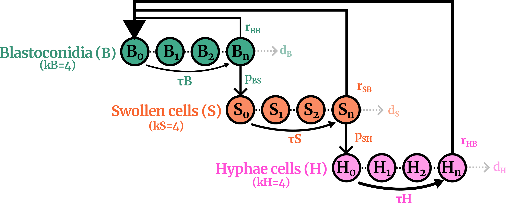

# Erlang-Chain ODE Model for A. pullulans differentiation

This repository contains code and data for fitting an Erlang-chain ODE model to describe the differentiation dynamics of Aureobasidium pullulans, based on quantitative time-lapse microscopy data (Rensink et al., 2025). The model captures the temporal changes in three key cell types:

- Blastoconidia (B) – asexual spores that can divide or differentiate into swollen cells.

- Swollen cells (S) – act as a developmental hub that can produce blastoconidia, hyphae, or chlamydospores.

- Hyphae (H) – filamentous cells that contribute to new blastoconidia formation and biofilm structure.

## Model Overview

To more accurately describe the timing of cell differentiation, each population (B, S, H) is represented as a chain of sub-stages (Erlang-chain formulation). This approach captures waiting times between transitions, corresponding biologically to internal cell development processes such as growth, DNA replication, and morphogenesis.

## Equations

Each chain is modeled as a set of coupled ODEs, with transitions between sub-stages governed by rates  and chain lengths . Transition probabilities and birth rates are included to represent differentiation between types:

Transitions: $p_{BS}$, $p_{SH}$ (per hour)

Birth rates: $r_{BB}$, $r_{SB}$, $r_{HB}$ (per hour)

Waiting times: ${tau_B}$, $tau_S$, $tau_H$ (in minutes)

Decay terms were included but constrained to small values to avoid overfitting with unrealistic death rates.

## Parametet fit

Model parameters are fitted using differential evolution (scipy.optimize.differential_evolution) with a loss function combining:

Sum of Squared Errors (SSE) between simulated and observed cell-type percentages (B, S, H) up to T = 15 h

A non-growth penalty, discouraging trivial solutions where no growth occurs.

## ODE model (plain Markdown source)

### Erlang-chain state variables
Let `B_i` for `i = 1..k_B`, `S_i` for `i = 1..k_S`, and `H_i` for `i = 1..k_H` denote the Erlang sub-stages of Blastoconidia, Swollen cells, and Hyphae, respectively. Totals are `B = Σ_i B_i`, `S = Σ_i S_i`, `H = Σ_i H_i`.

Define stage-throughput rates from waiting times (minutes → hours):

- `a_B = k_B / (tau_B / 60)`
- `a_S = k_S / (tau_S / 60)`
- `a_H = k_H / (tau_H / 60)`

Parameters (per hour unless stated): `p_BS`, `p_SH` (transitions), `r_BB`, `r_SB`, `r_HB` (birth rates into `B_1`), `d_B`, `d_S`, `d_H` (decay on last stages only), `tau_B`, `tau_S`, `tau_H` (minutes).

### Births into the first B sub-stage
`dB_1/dt = r_BB·B_{k_B} + r_SB·S_{k_S} + r_HB·H_{k_H} − a_B·B_1`

### Internal Erlang flows for B (no births except in `B_1`)
For `j = 2..k_B−1`:
`dB_j/dt = a_B·B_{j−1} − a_B·B_j`

Last B stage (`j = k_B`):
`dB_{k_B}/dt = a_B·B_{k_B−1} − p_BS·B_{k_B} − d_B·B_{k_B}`

### Erlang flows and transitions for S
Entry from `B_{k_B}` to the first S stage:
`dS_1/dt = p_BS·B_{k_B} − a_S·S_1`

For `j = 2..k_S−1`:
`dS_j/dt = a_S·S_{j−1} − a_S·S_j`

Last S stage (`j = k_S`):
`dS_{k_S}/dt = a_S·S_{k_S−1} − p_SH·S_{k_S} − d_S·S_{k_S}`

### Erlang flows and transitions for H
Entry from `S_{k_S}` to the first H stage:
`dH_1/dt = p_SH·S_{k_S} − a_H·H_1`

For `j = 2..k_H−1`:
`dH_j/dt = a_H·H_{j−1} − a_H·H_j`

Last H stage (`j = k_H`):
`dH_{k_H}/dt = a_H·H_{k_H−1} − d_H·H_{k_H}`

### Notes
- Births from `B_{k_B}`, `S_{k_S}`, and `H_{k_H}` contribute **only** to `B_1`.
- Decay terms `d_B`, `d_S`, `d_H` are applied **only to the last stage** of each chain, as in the code.
- In the shared code, any negative states are clipped to zero inside the RHS for numerical stability; analytically, states are non-negative by construction.

Model parameters were fitted using differential evolution (scipy.optimize.differential_evolution) with a loss function combining:

Sum of Squared Errors (SSE) between simulated and observed cell-type percentages (B, S, H) up to T = 15 h

A non-growth penalty, discouraging trivial solutions where no growth occurs.

## Biological Context

This model helps to interpret the quantitative microscopy from oCelloscope data showing how A. pullulans differentiates from blastoconidia into swollen cells and hyphae over time. Swollen cells act as a central hub, producing both reproductive (blastoconidia) and structural (hyphal) forms. Different strains (CBS 584.75, CBS 100280, CBS 109810, CBS 140240) exhibit distinct dynamics, possibly reflecting their ecological or genetic backgrounds.

## Data

Data were obtained using an oCelloScope imager and include time series of cell-type abundances for each strain presented in the study (DOI will be posted when published). See:

- CBS58475.csv 

- CBS100280.csv 

- CBS109810.csv 

- CBS140240.csv 

## Usage

# Fit model to a specific strain:

`python fit_erlang_chain.py`

With optional command line arguments:

- --manual, Run with fixed manual params and skip fitting
- --noplot, Skip matplotlib plotting window (png still produced)
- --seed <INT>, RNG seed for fitting
- --kB <INT>, length of B chain
- --kS <INT>, length of S chain
- --kH <INT>, length of H chainrain CBS58475

## Dependencies:

- numpy
- scipy
- matplotlib
- pandas

## Citation

This work has supported the following publication:

Rensink S., B,. van Dijk, Struck C., Wösten H.A.B. (2025) Swollen cells act as a hub for differentiation in Aureobasidium pullulans [In prep].

## License

Feel free to use, share, and build on this work — giving credit is appreciated. Science works best when it’s open.

Developed by Bram van Dijk (Utrecht University, Theoretical Biology Group)

